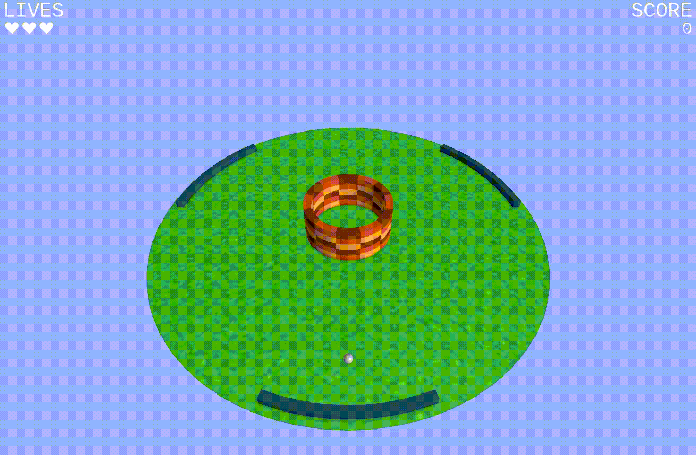

# Circular Pong —​​​​​​​ Small Game and Engine

Circular Pong is a minimalist game powered by a micro-engine, developed in C++ with OpenGL.
The game was developed for the PA199 course at FI MUNI.

The engine features a custom-built math library handling vectors, matrices, quaternions, and more, along with a basic physics and collision system. It includes object mesh generation and a rendering pipeline capable of rendering opaque as well as semitransparent objects, and screen space ambient occlusion. The engine also includes a simple UI system for rendering sprite-based interface elements.

The game itself is a twist on classic Pong: instead of a linear layout, the bricks are arranged in a circular formation. Players score by breaking bricks within this circle, but if the ball escapes the boundary, they lose a life. Players can always see where the ball is at all times thanks to the bricks' semitransparent rendering when the ball is behind them.

## Project Files

The game was developed inside a framework made specifically for OpenGL courses at FI MUNI.
This repository contains only source files written by me (Jakub Slezáček)
for the actuall game and therefore can not be build into a runnable file. 
Nevertheless, the repository contains all the important code for the actuall game.

In this repo you will find:

- math_library_dir - math library implementing Vectors, Matrices, Quaternions...
- engine_library_dir - engine library implementing features sharable across multiple games (camera logic, object rendering, ode solver...)
- ui_library_dir - code for rendering UI elements
- tests - tests for the libraries
- game_files, game_objects, game_ui - game logic, game ui
